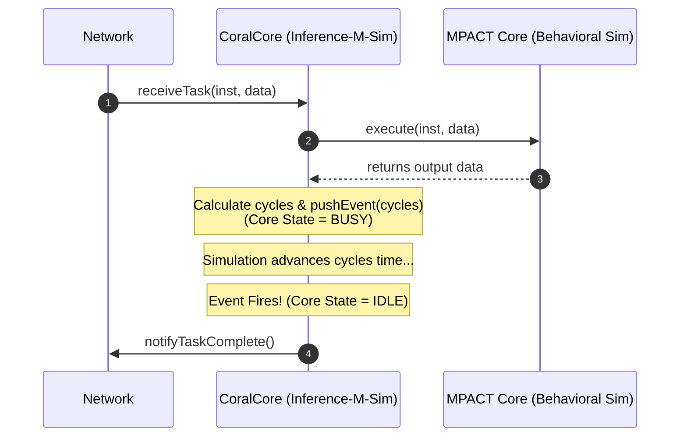

# Core Architecture & Co-Simulation Interface

This directory contains the core execution models for **Inference-M-Sim**.

## High-Level Sequence Diagram

The core operates using a **Transaction-Level Modeling (TLM)** co-simulation flow. The Network delivers instructions/data, the **MPACT** behavioral engine computes functional outputs, and **Inference-M-Sim** schedules cycle timing.

```text
[Network]                     [CoralCore]                 [MPACT Core]
   |                               |                           |
   |-- 1. receiveTask(inst, data)->|                           |
   |                               |-- 2. execute(inst, data)->|
   |                               |<- 3. returns output data -|
   |                               |                           |
   |                               |-- 4. Calculate cycles     |
   |                               |-- 5. pushEvent(cycles)   |
   |                               |      (Core state = BUSY)  |
   |                               |                           |
   |   ( ... Simulation advances `cycles` time ... )          |
   |                               |                           |
   |                               |-- 6. Event Fires!         |
   |                               |      (Core state = IDLE)  |
   |<- 7. notifyTaskComplete() ----|                           |
```

### Sequence Flow (Mermaid)



## Workflow Summary

1. **Trigger:** The Network checks data availability and calls `fetchAndExecute()` / `receiveTask()` on the core.
2. **Behavioral Execution:** The core invokes the embedded MPACT behavioral simulator to execute instruction math and produce bit-exact output data.
3. **Timing & Event Scheduling:** The core calculates execution cycles based on instruction complexity and schedules a delayed event using `pushEvent(cycles, callback)` in the simulation engine.
4. **Completion:** When the scheduled cycles elapse, the core marks itself `IDLE` and notifies the Network that output data is ready.
